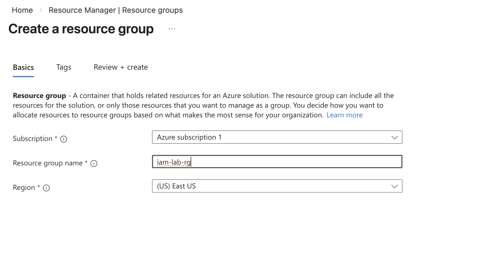
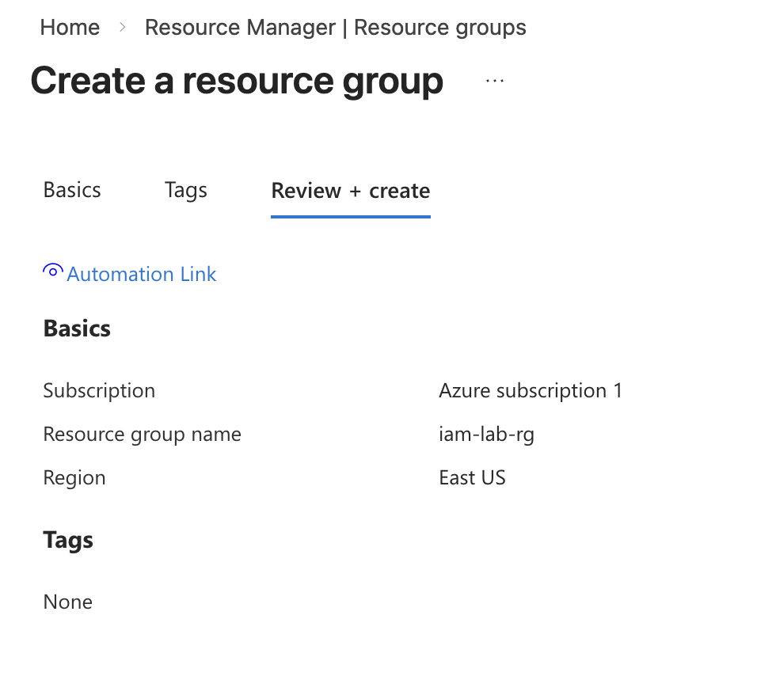

# Lab 1 — Azure Resource Group Creation and Management

## Objective

Create and manage an Azure Resource Group to organize and control access to Azure resources using Azure Role-Based Access Control (RBAC).

Resource Groups act as logical containers for Azure resources such as virtual machines, storage accounts, Key Vaults, and managed identities.

This lab establishes the foundation for all Azure IAM and access control labs.

---

## What is a Resource Group?

A Resource Group is a logical container used to:

- Organize Azure resources
- Apply access control (RBAC)
- Manage resource lifecycle
- Apply policies and governance
- Control permissions at a group level

---

## Prerequisites

- Azure account with active subscription
- Owner or Contributor permissions on subscription
- Access to Azure Portal

---

## Lab Steps

---

### Step 1 — Navigate to Resource Groups

In Azure Portal:

Search for:

Resource groups

Click:

Resource groups

Screenshot:

---

### Step 2 — Create New Resource Group

Click:

+ Create

Configure the following:

Subscription: Azure subscription 1  
Resource group name: iam-lab-rg  
Region: East US  

Screenshot:

---

### Step 3 — Review and Create Resource Group

Click:

Review + Create

Verify configuration details.

Screenshot:

---

### Step 4 — Resource Group Successfully Created

Click:

Create

Verify the Resource Group appears in the Resource Groups list.

Screenshot:

---

## Result

Successfully created Azure Resource Group:

Name: iam-lab-rg  
Region: East US  
Subscription: Azure subscription 1  

This Resource Group will be used in future IAM labs.

---

## Skills Demonstrated

Azure Identity and Access Management (IAM):

- Azure Resource Group creation
- Azure resource organization
- Azure RBAC foundation setup
- Azure subscription management
- Cloud resource governance fundamentals

---

## Why This Matters (Real-World Relevance)

In enterprise environments, Resource Groups are used to:

- Assign RBAC roles at group level
- Control access to multiple resources
- Organize environments (Dev, Test, Prod)
- Apply security policies
- Manage cloud infrastructure securely

IAM Engineers use Resource Groups to control identity access to cloud resources.

---

## Next Lab

Assign RBAC roles at Resource Group level to control user access.
