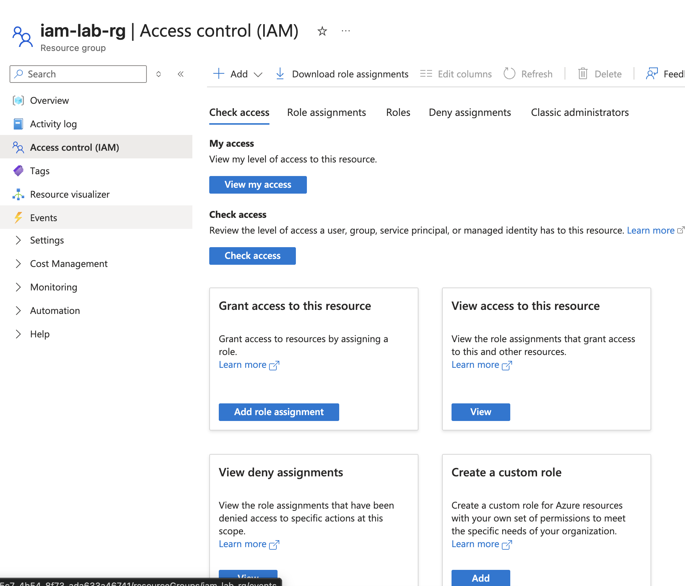
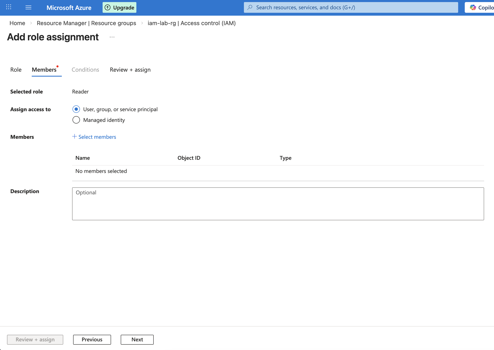
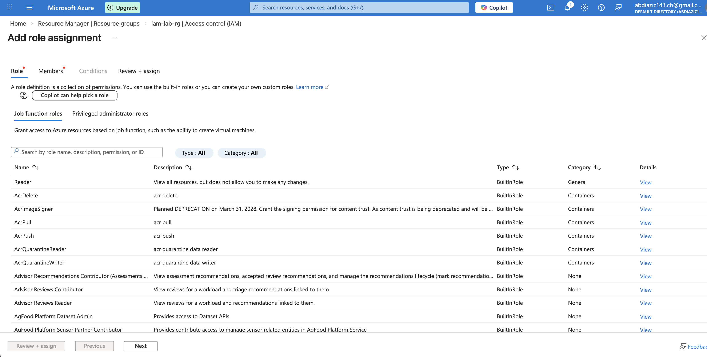
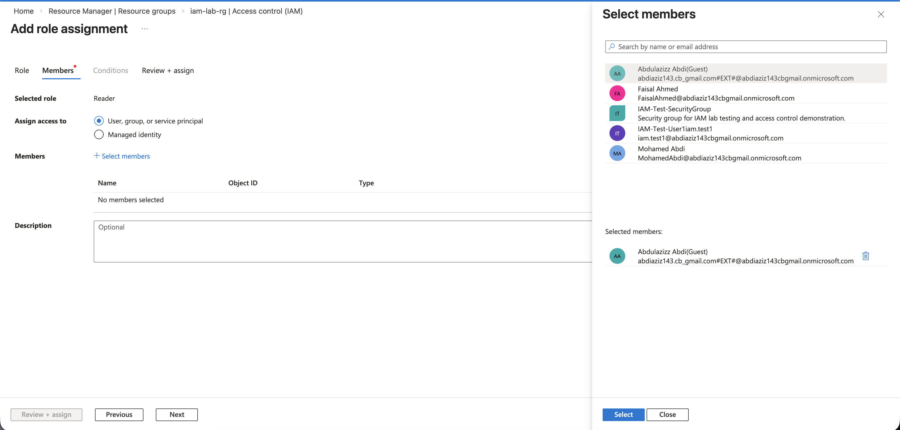
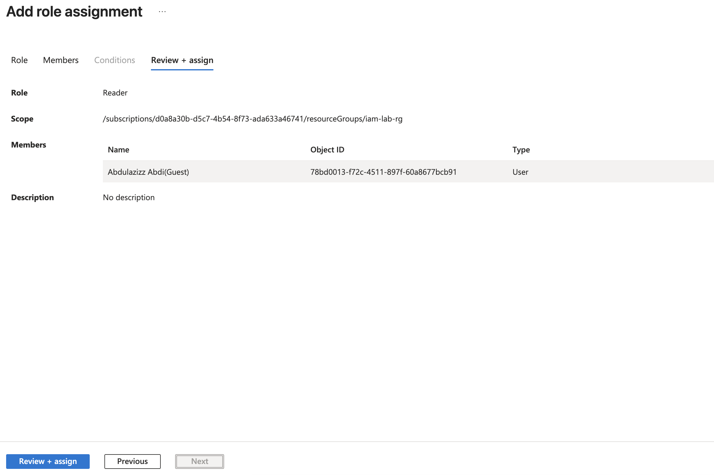
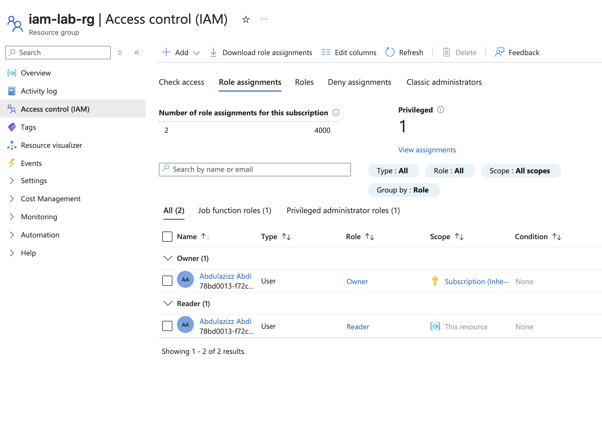

# Lab: Resource Group RBAC Configuration

## Objective

Configure Azure Role-Based Access Control (RBAC) to assign least privilege access to a user at the resource group scope.

This simulates real-world enterprise IAM access management.

---

## Lab Environment

- Platform: Microsoft Azure
- Resource Group: iam-lab-rg
- Role Assigned: Reader
- Scope: Resource Group
- Identity Type: Azure AD User

---

## Step 1: Open Resource Group IAM

Navigate to:

Azure Portal → Resource Groups → iam-lab-rg → Access control (IAM)

Screenshot:

---

## Step 2: Add Role Assignment

Click:

Add → Add role assignment

Screenshot:

---

## Step 3: Select Reader Role

Select role:

Reader

Screenshot:

---

## Step 4: Select Member

Assign role to user:

Abdulaziz Abdi

Screenshot:

---

## Step 5: Review and Assign Role

Verify:

- Role: Reader
- Scope: iam-lab-rg
- Member: Abdulaziz Abdi

Screenshot:

---

## Step 6: Verify Role Assignment

Confirm role assignment appears in IAM dashboard.

Screenshot:

---

## Result

Successfully assigned Reader role at the resource group scope.

User permissions:

- Can view resources
- Cannot modify resources

This follows the least privilege access model.

---

## Skills Demonstrated

- Azure RBAC configuration
- Role assignment
- Resource group scope access control
- Identity and access management
- Least privilege security model

---

## Real-World Relevance

This task is commonly performed by:

- IAM Engineers
- Cloud Identity Engineers
- Azure Administrators
- Cloud Security Engineers

RBAC ensures secure and controlled access to enterprise cloud resources.
